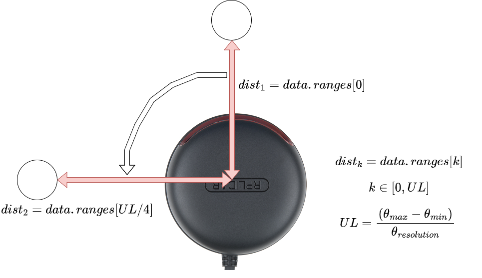
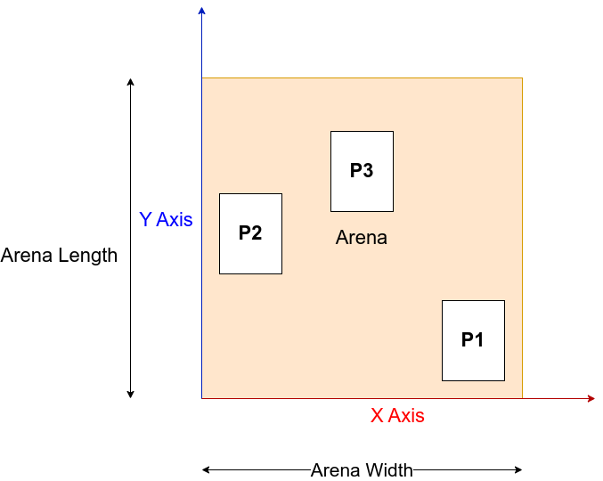

# LiDAR Experiments
This week will consist of the LiDAR experiments. Each group will attempt to localize the lidar on the given arena.

Since we have few available RPLIDAR sensors, the groups will be alotted 15 minutes each to collect data on the sensor. The processing of the data can be done during the week and the assignment is to be submitted by 4th March 11:59 PM (Hard Deadline)

Email a `.zip` file with the given format to `namanmenezes@iisc.ac.in` with the subject line as your group number

# Instructions 
Steps for the experiment:
1. Connect the LIDAR via USB 
2. Ensure that the baud rate on the RPLIDAR is set to 256000
3. Run the command `lsusb` you must have an output like
```
Bus 001 Device 006: ID 10c4:ea60 Silicon Labs CP210x UART Bridge
```

4. Install the ROS driver for the LiDAR using: 
```
sudo apt install ros-noetic-rplidar-ros
```
If you get the error:
```
Waiting for cache lock: Could not get lock /var/lib/dpkg/lock-frontend. It is held by process <process_id> (unattended-upgr)... 0s
```
You can kill the upgrade process by using:
```
sudo kill -9 <process_id>
```
then give the install command again.

5. Find the location of the LiDAR:
```
ls -l /dev |grep ttyUSB

```

6. Change the permissions of that port (change the port number based on step 5)
```
sudo chmod 777 /dev/ttyUSB0
```

7. Launch the ROS driver:
```
roslaunch rplidar_ros rplidar_a3.launch 
```

	(Note: Detailed instructions for the RPLIDAR can be found [here](http://wiki.ros.org/rplidar) )

8. Place the lidar on the positions P1, P2 and P3 as shown in the map
9. At each position record about 10 seconds of data using the command:
```
rosbag record -a -O P1.bag
```
Change the name of the bag for each position i.e. P2.bag and P3.bag

# Localization

The 2D LiDAR sensor can be used to localize the system within an arena. 
The following diagram describes the methods to access range data at a given position:




The following diagram shows the coordinate system to be used for localiztion:



The dimensions of the arena and the code skeleton is available in the file [`rpi_lidar.py`](./rpi_lidar.py)
```
arena_length = 0.97     # in metres
arena_width = 0.58      # in metres
```
# Assignment

## Part 1
You must estimate the position of the lidar in the arena based on the input laser scan data. To work with the recorded data from the robot you must do the following steps:

1. In first terminal run:
```
roscore
```
2. In another terminal run:
```
rosbag play P1.bag
```
Note the `--loop` flag can used to replay the bag in a loop
3. In the third terminal run your program code:
```
python3 rpi_lidar.py
```
4. Create a text file named `localize.txt` with the following format and type in the results for each point (in meters):
```
P1
X 0.10423587
Y 0.44342236
P2
X 0.66345453
Y 0.22123453
P3
X 0.16235454
Y 0.46172934
```

## Part 2
1. Download the rosbag called `experiment.bag`
2. Run your localization algorithm on all the data given in the bag and plot the x and y coordinates as a scatter plot
3. Save the final plot into an image file called `experiment.png`

## Submission Instructions
The final `zip` file for the assignment must contain the following:
1. A `localize.txt` file with the position of the LiDAR at P1, P2 and P3
2. The python file used to estimate the points named `Part1.py`
3. A `experiment.png` file with plot of the points estimated on the `experiment.bag` provided
4. The python file used to plot the points named `Part2.py`